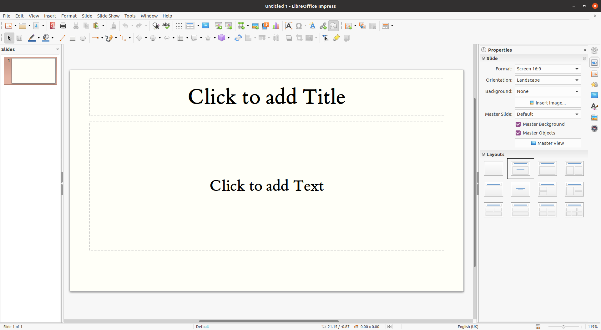
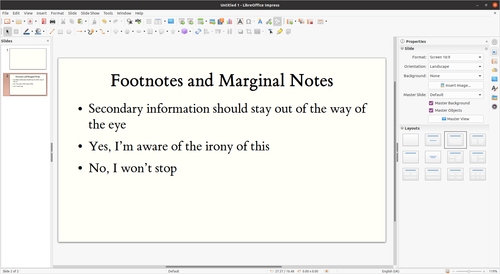

# Impress Tufte Template

A LibreOffice Template based on [TufteCSS](https://edwardtufte.github.io/tufte-css/)

## Screenshots

## Installation

- Open LibreOffice Impress
- Click "File" -> "Templates" -> "Manage Templates"
- Click "Import"
- Select a Category to import into (such as "My Templates")
- Select the `Tufte-Template.otp` file
